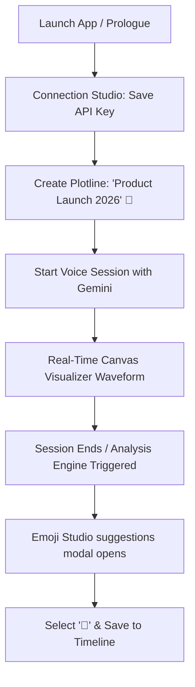

# StoryArc User Journeys & Persona Journeys

StoryArc transforms daily reflection into a cinematic narrative. The following detailed user journeys illustrate how different personas interact with the application’s core features, from onboarding to AI re-analysis and narrative timeline navigation.

---

## 👥 Personas Overview

| Persona | Archetype | Main Goal | Preferred Input | Key Feature |
| :--- | :--- | :--- | :--- | :--- |
| **Sarah Chen** | The High-Achieving Professional | Manage career stress & identify patterns of burn-out. | Voice (Live Session) | Mood Timeline Color Mapping |
| **Marcus Vance** | The Creative Novelist | Document worldbuilding ideas & track writing blocks. | Manual Text Entry | In-place metadata overrides (HITL) |
| **Elena Rostova** | The Mindful Practitioner | Process family transitions & track emotional recovery. | Voice & Manual | Emoji Studio (Symbolic Anchors) |

---

## 🎬 Journey 1: The Live Voice Reflection (Sarah's Path)
*Theme: Onboarding, Live Audio, & Emotional Sentiment Mapping*

### Phase 1: Onboarding & Initialization
1. **First Launch:** Sarah downloads the app during a high-stress product release week. She is greeted by the cinematic, dark **Prologue** screen, introducing her to the philosophy of "Plotlines" rather than traditional calendar timestamps.
2. **Secure Credentials:** She navigates to the **Connection Studio**. She pastes her personal **Gemini API Key** which is saved securely to `flutter_secure_storage`. Her key is stored locally to maintain privacy and data sovereignty.
3. **Establishing the Arc:** On the library dashboard, Sarah taps **Create Plotline**. She titles it *"Product Launch 2026"*, selects a deep purple gradient, and picks the rocket emoji (`🚀`) as the hero symbol representing this career chapter.

### Phase 2: The Real-Time Live Session
1. **Initiating voice:** Feeling overwhelmed after a stressful launch meeting, Sarah taps the mic icon on her Plotline details screen to start a **Live Session**.
2. **Conversational interface:** The UI shifts to a dark, fluid canvas. An animated audio visualizer waves gently in response to her voice. She talks freely for four minutes, detailing team friction and launch delays. Gemini listens, providing empathetic, low-latency vocal responses.
3. **Closing reflection:** When she feels complete, she taps the end button. The app displays the message *"Narrative Engine weaving your story..."* as the transcription is processed in a background Dart isolate.

### Phase 3: Narrative Anchor & Timeline Update
1. **Symbolic Selection:** A frosted glass bottom sheet (**Emoji Studio**) slides up, presenting three AI-suggested emojis: `😰` (anxiety), `🚀` (launch), and `🧗` (struggling climb).
2. **User Agency:** Sarah rejects the high-anxiety suggestion and taps `🧗` (representing her commitment to climb through the struggle).
3. **Timeline visualizer:** The session is saved to her timeline. It generates a title: *"Summit Friction"* and a mood rating of `-0.4`. On her timeline, a node displays the `🧗` symbol surrounded by a reddish-orange glow, visually highlighting a challenging period.

---

## 📝 Journey 2: The Custom Narrative Override (Marcus's Path)
*Theme: Manual Entry, In-place Overrides, and AI Re-Analysis*

> [!NOTE]
> Marcus uses StoryArc to capture quick flashes of creative inspiration. Because AI-generated descriptions are sometimes too literal, he heavily relies on **Human-in-the-loop (HITL)** controls to modify the output.

### Phase 1: Creating a Creative Entry
1. **Text entry:** Marcus opens the app on his tablet and taps the text editor icon on his *"Fantasy Novel WIP"* Plotline.
2. **Drafting:** He types out a brainstorming log:
   > *"Finally broke through the chapter 4 block. The protagonist needs to discover the obsidian key not in the castle, but buried under the roots of the weeping willow. The guardian of the tree is a blind falcon named Aether."*
3. **Saving & Synthesis:** He taps **Save**. The app makes a REST call to Gemini 1.5 Flash to synthesize the entry. The Emoji Studio prompts him with suggestions: `🗝️`, `🌳`, `🦅`. He picks `🌳` (the weeping willow tree).

### Phase 2: In-place Metadata Overrides
1. **Reviewing Detail:** Marcus notices the AI generated a title: *" obsidian key under the willow"*. He wants it to look more poetic.
2. **Title override:** He taps the title directly on the **Session Detail Screen**. A dark glassmorphic dialog opens. He renames it to: *"The Willow's Witness"*.
3. **Summary override:** He reviews the AI-generated summary: *"Protagonist finds an obsidian key in a weeping willow guarded by a falcon."* This is too dry. He taps the summary card and re-writes it: *"Discovering the secret key under the weeping willow, guarded by the silent watcher, Aether."*

### Phase 3: Transcript Alteration & Re-Analysis
1. **Updating log:** The next day, Marcus decides the guardian falcon should be an owl instead of a falcon. He edits the transcript text in-place, changing *"blind falcon named Aether"* to *"blind owl named Aether"*.
2. **AI Re-Analysis:** He taps the **Psychology (Re-analyze)** icon in the AppBar.
3. **AI update:** The loading screen fades, and the metadata updates dynamically:
   - **Suggested Emojis:** Updates to include `🦉` (owl) along with `🌳`.
   - **Summary:** Automatically reflects the change to the blind owl.
   - Marcus opens the Emoji Studio and selects the new `🦉` emoji to serve as the hero symbol for this session.

---

## 🧘 Journey 3: The Emotional Journey Map (Elena's Path)
*Theme: Emotional Arc Navigation, Cooldowns, & Timeline Recovery*

> [!TIP]
> The vertical timeline's gradient color-coding helps Elena see how her emotional state evolves over weeks of dealing with a difficult family transition.

### Phase 1: Reading the Emotional Canvas
1. **Visualizing trends:** Elena opens her Plotline titled *"Caring for Mom"*.
2. **Color tracking:** She scrolls down the vertical timeline:
   - **Older nodes** (from three weeks ago) are colored deep crimson (sentiment `-0.8`), showing her high anxiety during diagnosis.
   - **Middle nodes** shift to amber-yellow (sentiment `0.0`), marking periods of transition.
   - **Recent nodes** transition to a radiant emerald green (sentiment `0.7`), reflecting relief after securing stable care.
3. **Comparing reflections:** She taps a red node to open the **Session Detail Screen**. She reads the transcript to remember what she felt, then backs out and taps a green node, feeling a sense of closure and progress.

### Phase 2: Interactive Emoji Tuning
1. **Aesthetic alignment:** Elena wants all her transition sessions to share a consistent symbol.
2. **Replacing emojis:** She taps a session currently represented by a random `🏡` (house) emoji. On the detail screen, she taps the hero symbol. The `EmojiStudioWidget` pops up.
3. **Search integration:** She taps **Search Emoji**, type "heart", and selects `❤️` from the emoji picker. She repeats this for three other nodes, creating a clear visual rhythm of "care milestones" on her timeline.

### Phase 3: Cooldown Experience (Rate-limiting)
1. **Refining multiple entries:** Elena edits three transcripts in rapid succession and triggers the AI analysis on each to see how the sentiment scores fluctuate.
2. **Triggering the rate limiter:** On her sixth re-analysis request within a minute, she triggers the client-side mock limiter.
3. **Cinematic Warning:** Instead of a generic error code, the app blocks the button and displays a calming, purple pop-up:
   > **Take a Breath**
   > *Take a deep breath. You are reflecting too quickly. Please wait a moment before analyzing again.*
4. **Mindful Cooldown:** Recognizing the prompt as a reminder to pause, she takes a moment, waits for a minute, and then resumes her reflection.
